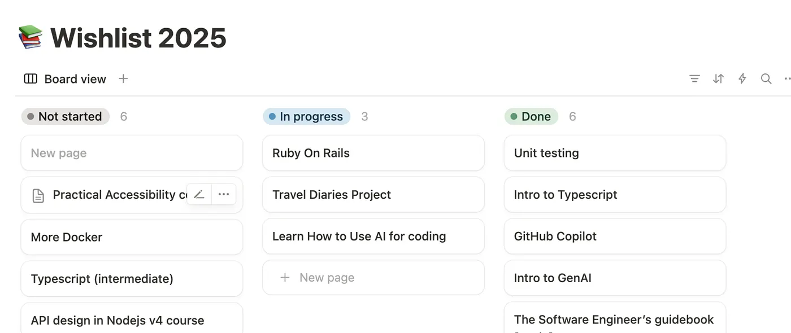

# What I’ve Learned After 18 Months of Getting Back To Coding While Working Full-Time (Part 2)

Coding at midnight. Debugging during lunch breaks. Meditation naps on the floor. In the last 18 months, I’ve learned that surviving this journey isn’t just about effort, it’s about strategy.

In Part 1, I shared how I returned to coding after years in customer-facing technical roles, while juggling a full-time team lead job. From time management and learning Ruby on Rails to battling mental fatigue… it’s been a ride.

But surviving the grind is only half the story. The real question became: how do I keep going without burning out?

The answer wasn’t just more effort — it was smarter effort. In this second part, I want to get real about how I learned to pace myself, protect my energy, and build sustainable habits without losing my momentum (or my mind).

Let’s dive into what’s been helping me stay in the game — and sane.

## ❌ Introducing No-Coding Weekends

Every 6 weeks, I would not code an entire weekend or even look at code. Sounds almost blissful compared to nearly every evening coding or learning, potentially, right? Well, somehow, my brain wouldn’t quite get the memo. It would find solutions to a problem, a question, or a bug I was trying to solve that very weekend… maybe while in the shower, maybe while on my bike, or while driving down Highway 15 Décarie. Next level annoying! I would pull out my phone, write a quick note in Notion, and get back to it the following week, praying I wouldn’t forget why I came to the conclusions I jotted down.

## 🥱When no-coding weekends aren’t enough

Another strategy I used was inserting two types of breaks within my working blocks: walking breaks and meditation breaks.

So I started adding two types of breaks during deep work blocks:

- **Walking Breaks**: I’d close my laptop and jump on my walking pad (because no way José was I going outside during Montreal winters—my soul is full-on island lady 😅). I'd put on some music and just move.
- **Meditation Breaks**: I’d lie down on my mat, set a timer for 10 to 15 minutes, and try to clear my mind. Caution: If you’re too relaxed, you might doze off, just ask me how I know. On the bright side, I’d wake up somewhat refreshed and ready to tackle round two, three, or four, depending on the day and what my “menu” was for the day.

In the end, it’s all about trying to find some balance. What worked for me may be different from what works for you, and that may also change depending on your season of life, personal life circumstances, and outside work commitments. Find your recipe but remember that rest needs to be an integral part of it. Craft a space for recovery!

### So what’s been working for me now?

Recognizing that rest isn’t a luxury but a necessity has been critical for me. Instead of rigidly adhering to a set schedule (don’t get me wrong, the schedule is important), I’ve learned to adapt my approach based on my energy levels and mental capacity. I make my needs fit my schedule, not the other way around.

If I need more rest for one week or am overwhelmed, I change my pace or my focus. Sometimes that looks like adjusting the ratio of my project work compared to reading or meetups. If I don’t have the mental capacity to dive into deeply technical subjects, it’s a better time to dive into some reading that is easier to digest.

And here’s the kicker: I’ve embraced the power of grace. It’s okay to acknowledge that I can’t do it all, all the time. While society may try to label me as “Wonder Woman,” I’ve learned to extend grace to myself, recognizing my limits and knowing when to push and when to rest.

It’s okay to be “off-schedule” sometimes, and it’s definitely okay to take time with friends and family over these when needed. Know your limits and stop before you reach them! In the end, progress is better than perfection. After all, life happens, and sometimes the best thing I can do is take a step back and recharge. One more thing that’s been really helpful is as well is…

## Making A Wishlist

Ever sat down to learn something new and instantly spiraled into “Where do I even start?” mode? Well, I have and that’s why I created a wishlist.

It’s where I brain-dump everything I want to learn or build without pressure and no deadlines.

As the year progresses, I keep revisiting it. Anything that is not critical or a high priority goes into the wishlist. When I do have bandwidth, I can pick what excites me instead of spiraling into decision fatigue.

I can’t do it all and certainly not all at once! As such, I had to be selective with where I invested my energy. I have to say, though, it’s kind of nice to move some items into the ‘Done’ column 😏.

## 🔜 Coming Up Next: Tackling the Tough Stuff

But wait — there’s more! In the next part of this series, I’ll be diving into the deeper waters: motivation slumps, distractions, self-doubt, impostor syndrome, and yes… grief.

It’s about to get super candid in here.

## 💬 Let’s Talk!

What about you?
How do you balance learning, working, and living without losing your spark?

I’d love to hear what works for you, or what you’re still figuring out. Drop a comment or get in touch on LinkedIn. Let’s build healthier, more sustainable tech journeys together.
