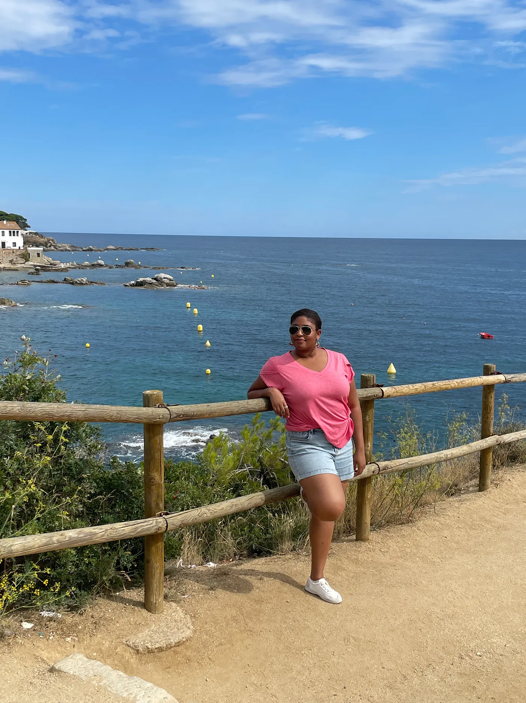

# What I’ve Learned After 18 Months of Getting Back To Coding While Working Full-Time (Part 3)

Well first, if you’ve following along now for three consecutive articles, let me start by saying THANK YOU! Honestly, sharing my story is quite liberating. I just hope it helps at least one person out there. If it does, then it’s all worth it to me.

So let’s recap, in Part 1, I shared how I returned to coding after years in customer-facing technical roles, all while juggling a full-time team lead role. Then last week, in part 2, I shared all the strategic work that needs to happen outside of coding like time management, learning strategies and rest.

Today, I’m diving into the inner work. The mental and emotional resilience this journey has demanded. And next week, in the final chapter of this series, I’ll talk about the rewards I’ve taken away from all of this. The wins, the milestones, and where I’m headed next.

But first, let’s talk about this rollercoaster called

## Motivation

Some days are easy.
Some days are hard.
Some days are “what the heck am I doing here? Why am I doing this to myself? Caray!”

When I started this journey, my motivation was pretty clear. I’m not someone who jumps into a huge commitment without deep thought. I didn’t decide overnight to get back into software development. In fact, I had been thinking about it since 2021. It took about a year and a few months before I finally said yes.

In 2022, I considered whether a formal people leader role would be a better fit. At first I thought yes, this is it. But it wasn’t. What drew me to that role was the coaching and mentoring side. Helping people grow, cheering them on. But with time and my experience in a people leader role for the past 2 years, I realized being in management wasn’t actually what I wanted most. In fact, it became quite clear after only a few months in my role.

So back to the individual contributor track I’m heading soon. And honestly, I’ve even realized that a staff or tech lead role might be more aligned for me in the future, years into the future. But let’s not skip too far ahead. 😄

So how did I know this path was the right one?

I asked myself a few questions:

Why do I want this?
What’s drawing me in?
What are the skills I most enjoy using?
And if I couldn’t pursue this, how disappointed would I be — and why?

After reflecting, it all came back to my love for products and technology, the excitement of building something new, the joy of learning, and the impact my work can have on people. And honestly, that little thrill I get from debugging something complex, even when it drives me up a wall. There’s something about it that makes me feel alive.

And now, let me confess something a little personal. When I first stepped into tech, I wanted to be the next Chloe O’Brian. I know. Wild! I’m no Chloe, just to be clear, but wow, what that woman could do with a keyboard and her brain was exciting to watch! If you know who I’m talking about, props to you. If not, I forgive you, but go stream 24 and get a little Kiefer Sutherland drama in your life.

My biggest advice to anyone thinking about entering software development, or any field for that matter, is this: get clear on your why. And if you don’t believe that understanding the “Why” is the key, go read Simon Sinek’s book on the topic! When things are going well, it’s easy to stay focused. But when things get hard, and they will, what’s going to keep you going is discipline and a deep sense of purpose. That intrinsic motivation is gold!

But let’s be real. Life is not linear. And along the path to any goal, you’ll face all kinds of distractions as I have. So let’s talk about that.

## Distractions, Life, and Letting Go of the “Perfect” Focus

Trying to become (or I guess re-become) a software engineer has come with its fair share of distractions. And I’m not just talking about external stuff.

There’s the internal noise. That loud voice in my head that tells me I don’t belong. The imposter syndrome. The overthinking. The mental clutter.

Then there’s everything else. The new tech tools popping up every other week. Stress from the day job. Health issues. Social life. Grief. Unexpected family challenges. World events. Haiti. Mom landing in the emergency room. So much I’ve had to hold at once.

When distractions hit, I learned not to ignore them. But I also knew I needed a plan. I couldn’t just work when I “felt like it.” I had to carve out space for it.

Sometimes that meant 30-minute blocks. Other times, I had to log off everything, especially social media. I even deactivated Facebook — and it’s still off. It’s honestly one of the best decisions I made.

During high-stress moments, I’d swap out heavy tasks for lighter ones. I paid attention to my energy levels. Sometimes, that meant doing something small just to get moving. Other times, I’d let music carry me into the work zone. I always have one playlist that gets me going, no matter how I feel.
Well… almost no matter what. Because there was one thing my playlist couldn’t help me with.

## Grief

Yep. We’re going there.

This isn’t the easiest part to write about, so thank you for sticking with me.

During this comeback season, I’ve experienced more loss than I could have imagined. From church family members to my own father. Grief became part of the journey. And it hit me hard!

Two losses in particular rocked me, and they still do. But with love, faith, time, and the people around me, I’ve been able to keep going.

In September 2024, I was living in Barcelona for six months. It was beautiful. I loved it and would absolutely do it again very soon!

Forgive me, I digress…

But during a trip to Italy with two family members, I got the kind of news no one wants to hear. My father had passed away. And despite the complicated relationship we had, it shook me. Because of the situation in Haiti, I couldn’t go. The funeral happened from a distance.

Two days after I got back to Barcelona, I fell apart. Alone in my apartment, it all came crashing. Three weeks later, my mentor, spiritual leader, and dear friend Daniel passed away too. The very person I would have turned to in that moment was gone.

I was crushed. But I still had to go back to work.

Those were some of the hardest months of my life. I didn’t make huge progress. But little by little, I moved forward. One lesson at a time. One tutorial at a time. One breath at a time.

And when I couldn’t? I didn’t force it. Grace reminded me that growth and healing are not always linear and that’s okay. After all, I’m only human.

## What Helped Me Most

What helped me most during that season was leaning on the people who loved me, staying grounded in my faith, journaling, therapy, and staying connected to community.

Even halfway across the world, I found support. I had friends in Barcelona who stood by me. I had people back home who checked in. There were ups. There were real deep downs too.

Eventually, I realized I needed time off from some responsibilities. I was extremely exhausted. Burnt out. Emotionally, physically, spiritually. And taking that pause helped me come back with more clarity and strength but it was no magic pill…

It’s okay to slow down. It’s okay to stop and rest. And it’s more than okay to celebrate your progress, no matter how small.

## Celebrate the Wins

When you’re going through big change, it’s easy to ignore the small wins. We skip over them. We don’t give them credit.

But during my hardest moments, those little wins were everything. One Leetcode problem. Getting authentication to work on my JamSess app. Adding a search bar. Finishing the first lesson of a course. These weren’t just tasks. They were proof I was still moving forward.

I wrote every one of them down in my journal as gratitude items. Even when I had no energy, even when life felt too heavy, those moments gave me something to hold onto.

And you know what? One of my roommates in Spain took me out to dinner when my scrappy app was done. I didn’t even feel like going, but we did it anyway. And that celebration mattered.

So celebrate the wins. Especially when life is messy.

Coming up in Part 4: the highlights, the wins, and the next steps in my journey. I’ll be sharing the moments I’m proud of and where I hope this path takes me next really soon.

Can’t wait to share it with you. 🥹
