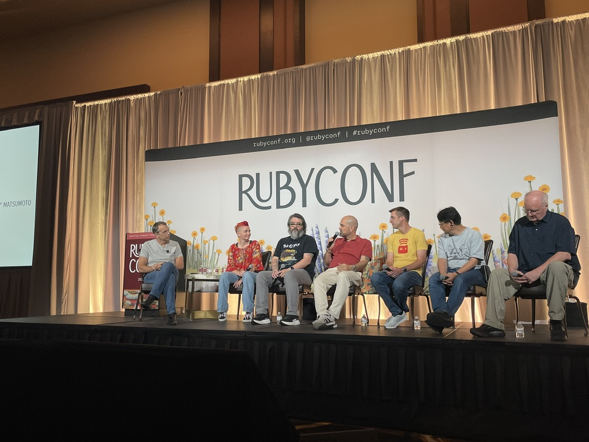
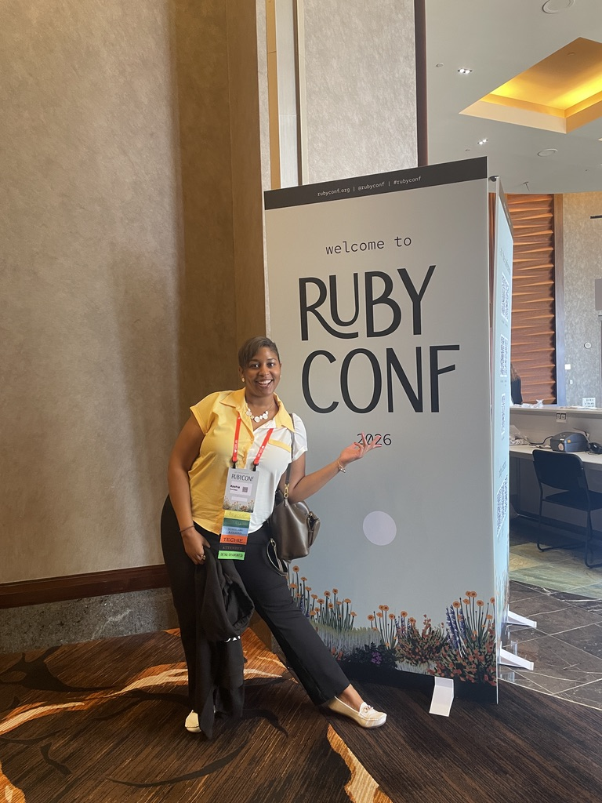

It’s now been a full week since I’ve returned from RubyConf... and I have a few things to share.

This year, I decided to attend RubyConf and was accepted as a scholar. Through that program, I got to attend the conference and meet others who are relatively new to the Ruby ecosystem. From meeting Matz in person, to hearing stories about past RubyConfs, to hackathons and shared meals, RubyConf is definitely an experience I’d recommend.

It all started with one goal: meet other developers in the ecosystem and continue growing in the community. Looking back, it exceeded every expectation I had.

The Scholars and Guides program, created by Ruby Central, pairs aspiring or new Rubyists with experienced members of the community to help them get the most out of RubyConf. Before the conference, I was matched with a guide and we met virtually to chat about their experiences attending past conferences. They encouraged me to plan ahead and be intentional about what I wanted to get out of the week instead of trying to do everything. We also talked about the small Ruby project I was building in anticipation of the conference and they shared advice on making the most of the experience.

It is definitely a program I'd recommend to anyone joining the Ruby ecosystem. Beyond the mentorship itself, I got to meet other scholars who were either new developers or relatively new to Ruby. One of my favorite parts of the week was simply hearing everyone's story. We all arrived through different paths, had different experiences, and were at different stages of our careers, yet we all shared the same excitement for learning and building.

As a first time attendee, I spent my days bouncing between talks and workshops from morning until late afternoon. There was always something happening. I also got to "disvirtualize" a few people I had only ever seen through a screen, including folks from WNB.rb living in different countries.

Some talks were inspiring, some challenged the way I think, and yes... some went completely over my head 😅. That's totally ok, and honestly expected. I took notes, asked questions, and wrote down things to learn more about later. That's part of attending a conference like this.

There were so many great sessions that I could easily write an entire post about them, but I'll spare you. A few stood out to me. Hearing Matz talk about how he's been enjoying vibecoding and using AI to explore projects he never had time to build was unexpected. Dalma Boros' Makeover Monday reminded me that sometimes one small idea can create a ripple effect across an engineering team, improve onboarding, and create a space where developers can openly share ideas and make the product better for everyone.
Obviously, I could go on and on about many of the talks between the ones that triggered ideas, inspired me, and the ones that went way over my head 😅 (that's totally ok and expected by the way. Just take notes, ask questions, and look things up later), but let's not. Best you catch the recordings when they come out. However, I'd recommend two in particular: Jessica Kerr's keynote and Brandon Weaver's We Who Remember Magic.

As a scholar, I also had the opportunity to contribute to RubyConf by working on a mini project around the theme of connecting Ruby to one of our hobbies.
As soon as that theme was announced, I knew exactly what I wanted to build.

**Salsa.**

I built a gem that analyzes salsa dancers' areas for improvement and "offenses" while dancing. Building the gem was fun, but it wasn't the part that challenged me the most.
The real challenge was standing in front of hundreds of developers I'd never met before and giving my very first lightning talk titled: What Salsa dancing taught me about beautiful Ruby.

For months, even at local meetups, I'd wondered when I'd finally find the courage to present. Don't get me wrong, I've spoken in public before. But speaking about something where I don't consider myself an expert was a completely different experience, and a humbling one.

Thankfully, the Ruby community turned out to be exactly what so many people had told me it was: welcoming and supportive. People came up to congratulate me, encourage me, share their own experiences, and simply strike up conversations.

Looking back, that was the real gift of the entire week: getting to connect with people. And those conversations are probably what shaped my biggest takeaway from the conference.

Without a doubt, the conference did not lack in AI content. Some of us might even be saturated at this point hearing about AI while others can't get enough. Regardless of which side you fall on, or maybe you swing back and forth as is natural, I think we've all had one question living rent free in our minds: where do I, the human, fit in the age of agentic development?

For this reason, I invite you to listen to Jessica Kerr's keynote. It was real. No fluff, no utopian vision, and most importantly, it considered us, the humans. Because let's be honest, we've been hearing a lot about the "machines" lately, but not nearly enough about the humans.

As software developers, programmers, and problem solvers, it's always been about more than code, even when we love writing code. So the idea of losing the parts we love about engineering is hard. But what if we didn't have to lose them? What if, like we've done many times before, this is simply another reshaping of our experience and our role? What if we could continue delivering value without crashing and burning, while also drawing inspiration from the things outside our little developer bubble and bringing that back into the work we do?

The human side of the equation, how we fit, how we reframe, and how we remain connected to our humanity, is what I enjoyed hearing about the most. Because let's be honest, these days all we hear about is AI, velocity, and the infamous "deliver more value" (hatchoum: probably at a rate where our customers won't even be able to keep up and will end up feeling incredibly overwhelmed... but that's a conversation for another time).

For anyone considering attending RubyConf, I'd say do it.
And if you're new to Ruby, I'd recommend applying to the Scholars and Guides program even more. The experience is ultimately what you make of it, but you'll find yourself surrounded by people who remember what it's like to be the new person in the room.

A few things I'd recommend:

- Plan ahead. Pick the talks and workshops you don't want to miss.
- Don't try to attend everything. Taking breaks is important too. I escaped outside a few times just to sit in the sun for five or ten minutes and reset.
- Talk to people, even if it feels awkward. For my fellow introverts, you're probably not the only introvert in the room. Doesn't matter if it feels weird at first, just do it. We're all weirdos anyway.
- Go to at least one social event, especially earlier in the conference before your social battery runs out.
- Attend a talk even if you have absolutely no idea what it's about. You might be surprised. I walked into Authentication Hell and walked out learning about a game Mike Dalton built based on the daily frustration of authenticating into everything at work 😅. Can you relate or what?!

In the end, RubyConf was one of those experiences I'll remember for a long time. I learned a lot, realized just how much more there is still to learn, met incredible people, and finally did something that had intimidated me for months.
Hopefully this was the first of many RubyConfs!

And until next year, if you missed this one, keep an eye out for the recordings on YouTube. Better yet, go find your local Ruby meetup. The Ruby community is much bigger than one conference, and that's probably one of my biggest takeaways from this whole experience.

